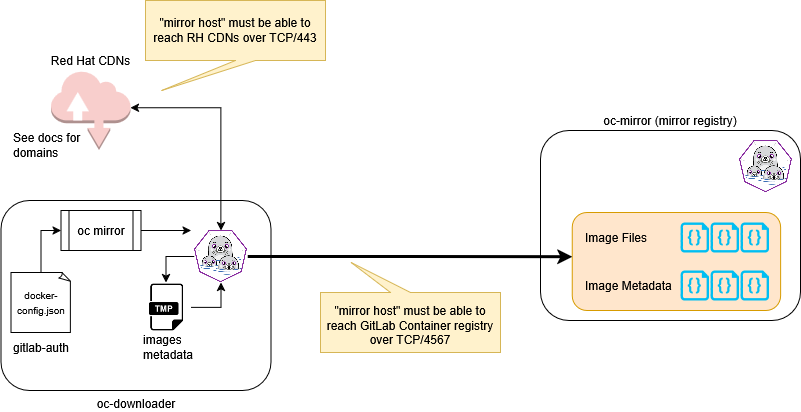

# OpenShift Air-Gapped OC Mirror Setup

## Overview

## Infrastructure Prereqs

## Virtual Machines to Build
| hostname      | network               | vCPU | MEM    | DISK      | Ingress FW Ports | OS       | PKGS                                                        | Purpse/Notes                                                                                                                                  |
|---------------|-----------------------|------|--------|-----------|------------------|----------|-------------------------------------------------------------|-----------------------------------------------------------------------------------------------------------------------------------------------|
| oc-downloader | connected to internet | 4-8c | 8-16GB | 1.5-2.0TB | NA               | RHEL v8+ | podman, oc-mirror, vim, tmux                                | This host is the one that will pull all of the images down from the internet and then we will tar them up to migrate to the airgapped network |
| oc-tools      | air-gap               | 4c   | 8GB    | 100GB     | NA               | RHEL v9  | oc, oc-mirror, openshift-install, kubectl, helm, curl, tmux | This will be the host that we use to install openshift on the nodes and unpack and import the images to the disconnected registry             |
| oc-mirror     | air-gap               | 8c   | 16GB   | 1.5-2.0TB | TCP/500, TCP/443 | RHEL v9  | mirror-registry, podman                                     | This host will act as our temporary air-gapped container image registry that will be used to bootstrap the cluster install                    |

## oc-downloader Firewall Whitelist
* You will need to ensure that the oc-downloader host can access the following domains
* Feel free to use wildcards in the ruleset eg. `*.quay.io`

| URL                                      | Port | Function                                                                                                                                                                                           |
|------------------------------------------|------|----------------------------------------------------------------------------------------------------------------------------------------------------------------------------------------------------|
| registry.redhat.io                       | 443  | Provides core container images                                                                                                                                                                     |
| access.redhat.com                        | 443  | Hosts a signature store that a container client requires for verifying images pulled from registry.access.redhat.com. In a firewall environment, ensure that this resource is on the allowlist.    |
| registry.access.redhat.com               | 443  | Hosts all the container images that are stored on the Red Hat Ecosystem Catalog, including core container images.                                                                                  |
| quay.io                                  | 443  | Provides core container images                                                                                                                                                                     |
| cdn.quay.io                              | 443  | Provides core container images                                                                                                                                                                     |
| cdn01.quay.io                            | 443  | Provides core container images                                                                                                                                                                     |
| cdn02.quay.io                            | 443  | Provides core container images                                                                                                                                                                     |
| cdn03.quay.io                            | 443  | Provides core container images                                                                                                                                                                     |
| cdn04.quay.io                            | 443  | Provides core container images                                                                                                                                                                     |
| cdn05.quay.io                            | 443  | Provides core container images                                                                                                                                                                     |
| cdn06.quay.io                            | 443  | Provides core container images                                                                                                                                                                     |
| sso.redhat.com                           | 443  | The https://console.redhat.com site uses authentication from sso.redhat.com                                                                                                                        |
| *.apps.<cluster_name>.<base_domain>      | 443  | Required to access the default cluster routes unless you set an ingress wildcard during installation.                                                                                              |
| api.openshift.com                        | 443  | Required both for your cluster token and to check if updates are available for the cluster.                                                                                                        |
| console.redhat.com                       | 443  | Required for your cluster token.                                                                                                                                                                   |
| mirror.openshift.com                     | 443  | Required to access mirrored installation content and images. This site is also a source of release image signatures, although the Cluster Version Operator needs only a single functioning source. |
| quayio-production-s3.s3.amazonaws.com    | 443  | Required to access Quay image content in AWS.                                                                                                                                                      |
| rhcos.mirror.openshift.com               | 443  | Required to download Red Hat Enterprise Linux CoreOS (RHCOS) images.                                                                                                                               |
| sso.redhat.com                           | 443  | The https://console.redhat.com site uses authentication from sso.redhat.com                                                                                                                        |
| storage.googleapis.com/openshift-release | 443  | A source of release image signatures, although the Cluster Version Operator needs only a single functioning source.                                                                                |

